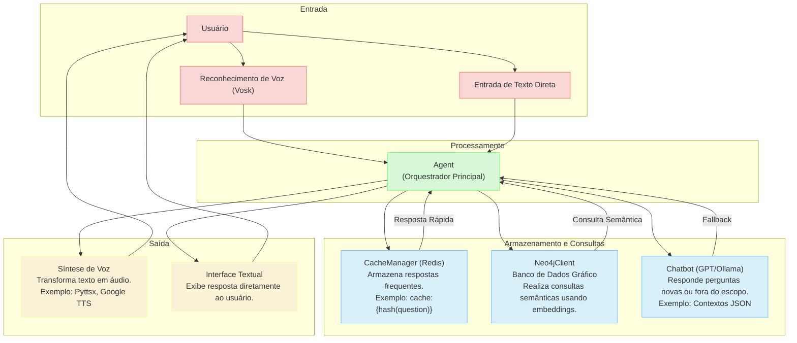

# Fluxograma do Projeto

O fluxograma abaixo representa o fluxo de funcionamento do sistema:

```mermaid
flowchart TD
    %% ==============================
    %% Entrada do Usuário
    %% ==============================
    Usuario[Usuário] --> ReconhecimentoVoz["Reconhecimento de Voz (Vosk)"]
    Usuario --> EntradaTexto["Entrada de Texto Direta"]

    %% ==============================
    %% Processamento pelo Agent
    %% ==============================
    ReconhecimentoVoz --> Agent["Agent\n(Orquestrador Principal)"]
    EntradaTexto --> Agent

    %% ==============================
    %% Decisão do Agent
    %% ==============================
    Agent --> CacheManager["CacheManager (Redis)\nArmazena respostas frequentes.\nExemplo: cache:{hash(question)}"]
    Agent --> Neo4jClient["Neo4jClient\nBanco de Dados Gráfico\nRealiza consultas semânticas usando embeddings."]
    Agent --> Chatbot["Chatbot (GPT/Ollama)\nResponde perguntas novas ou fora do escopo.\nExemplo: Contextos JSON"]

    %% ==============================
    %% Armazenamento e Consultas
    %% ==============================
    CacheManager -->|Resposta Rápida| Agent
    Neo4jClient -->|Consulta Semântica| Agent
    Chatbot -->|Fallback| Agent

    %% ==============================
    %% Saída para o Usuário
    %% ==============================
    Agent --> SinteseVoz["Síntese de Voz\nTransforma texto em áudio.\nExemplo: Pyttsx, Google TTS"]
    Agent --> InterfaceTextual["Interface Textual\nExibe resposta diretamente ao usuário."]
    SinteseVoz --> Usuario
    InterfaceTextual --> Usuario

    %% ==============================
    %% Estilo dos Blocos
    %% ==============================
    classDef entrada fill:#f9d7d7,stroke:#f66,color:#333;
    classDef processamento fill:#d7f9d7,stroke:#6f6,color:#333;
    classDef armazenamento fill:#d7f0f9,stroke:#6bf,color:#333;
    classDef saida fill:#f9f2d7,stroke:#ff9,color:#333;

    %% ==============================
    %% Aplicar Estilos
    %% ==============================
    class Usuario,ReconhecimentoVoz,EntradaTexto entrada;
    class Agent processamento;
    class CacheManager,Neo4jClient,Chatbot armazenamento;
    class SinteseVoz,InterfaceTextual saida;

    %% ==============================
    %% Comentários Adicionais
    %% ==============================
    subgraph "Entrada"
        Usuario
        ReconhecimentoVoz
        EntradaTexto
    end

    subgraph "Processamento"
        Agent
    end

    subgraph "Armazenamento e Consultas"
        CacheManager
        Neo4jClient
        Chatbot
    end

    subgraph "Saída"
        SinteseVoz
        InterfaceTextual
    end
```